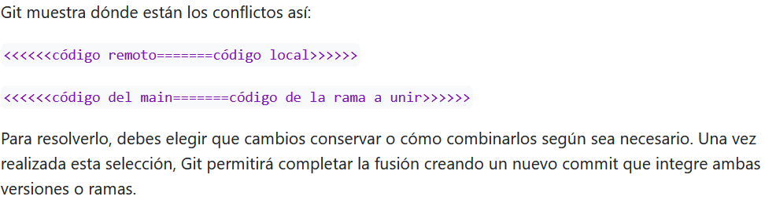

## Día 2 (5abril2026) / PARTE 3

## Introducción GitHub

Es una especie de bilbioteca o repositorio que tiene la gente para colaborar en códigos. Tiene un toque de red social como facebook en el que puedes seguir a otras personas.

Cuando creas un repositorio, es buena idea crear un archivo .gitignore, que es una carpeta que tiene archivos que no quieres que se vean. ej. Historia de R, etc. Puedes especificarle el formato de archivo que quieres que ignore. Ej. .pdft. Así no te actualizan los cambios de estos archivo todo el rato.

La web de GitHub es el repositorio en sí, la nube. El desktop de GitHub es la aplicación que está entre el ordenador y la nube, donde puedes registrar todos los cambios que haces antes de subirlos a la nube. También podrías sustituir el desktop por la conexión entre la web y Rstudio pero entonces no se ven tan claras los commits y las actualizaciones que has hecho. Pero es una opción. Te saldría una nueva pestaña "GitHub" en environment de RStudio.

Recuerda que para poder trabajar con un repositorio, tienes que clonarlo en tu ordenador (solo la primera vez que trabajas), a partir de ahí todos los cambios que se hagan son con pull y push y solo suben los cambios específicos. Cuando clonas el repositorio, lo guardas en tu ordenador. Lo puedes cambiar de sitio en tu ordenador. Para clonar un proyecto que te comparte tu compi, le das al Desktop, clonar el repositorio de alguien, pones el nombre de tu compi o copias el link del proyecto en la pestaña URL. Eliges dónde se va a guardar en tu ordenata y a correr.

Colaborar es como trabajar en un triángulo sin cerrar en la base. Tú trabajas, commit en tu ordenador, push a la nube. Tu compañero pull los cambios a su ordenador, trabaja, y vuelve a push los cambios a la nube. Pero nunca es directa entre tu compañero y tú. Es mejor no trabajar a la vez sobre el mismo código para que no haya problemas de compatibilidad. Es mejor que cuando uno acabe, el otro trabaje. En caso de tener que trabajar a la vez sobre el mismo código, saldrá el "Can't automatically merge" (Merge conflict) y saldría así:



Se resuelve manualmente.

Archivo de licencia de uso. Normalmente se estructura con una carpeta de código, una de datos, una de documentos y otra de figuras. Puedes poner palabras clave, una descripción.. las estrellas son likes, watch te da las notificaciones, los contribuidores.

Un commit es una especie de captura del Git en ese momento y se sube a la nube. Así se registran los cambios. Push es cuando lo subes a la nube y pull es cuando bajas los cambios que ha hecho otra persona.

Hemos creado un nuevo repositorio público sin licencia. Pero la licencia más común es MIT.

Ahora conectamos este repositorio con un proyecto de RStudio.

Si quieres volver a ver cómo estaban los archivos del repositorio en un momento dado, puedes entrar en el commit que quieras ver y puedes browse files para ver los archivos que había en ese momento.

```{r}
library(tidyverse)
dt <- penguins
ggplot(dt, aes(x = body_mass, y = bill_len)) +
  geom_point()
```

## 
